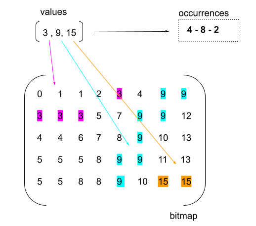
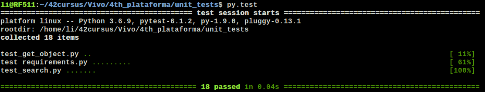
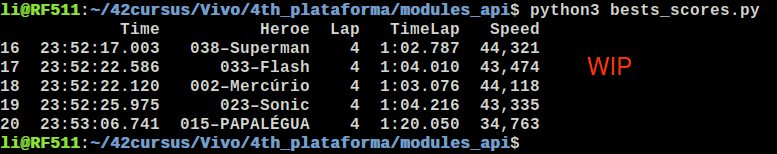

# 4th_plataforma
This project is part of the Vivo challenge for new developers. It consists of 3 challenges, as follows:
Note: See ./subject for more details.

<h2><b>***** 1th challenge*****</b></h2>
Given values from 0 to 15, generate a statistic of its occurrence in a bitmap image (which can be represented by an M x N matrix), as shown in the following figure:

- This challenge was developed in python v3.6.9.
- Script: <b>prova_desenvolvedores_4p_1.py</b>
- To run: $ python3 prova_desenvolvedores_4p_1.py
- --------------------------------------
- Requirements: python v3.x instaled
  
<b>******To run unit tests:</b>
- go to <b>./unit_tests</b> 
- To run: run py.test to run all tests. 
  <b>(unit_tests)$ py.test</b>
  (Or py.test name_of_file.py to run a particular test.)
- --------------------------------------
- Note Requirements: You must have pytest installed on your machine. See https://docs.pytest.org/en/stable/ for instructions:
- Requirements: pytest instaled
- $ python3 -m pip install -U pytest

<b>$ py.test</b>

<h2><b>***** 2th challenge*****</b></h2>

Transform the previous algorithm into a <b>Rest API</b>.
- Input parameter: list with the values
- Output: output of the algorithm in JSON format.

This API was developed on Flask Framework. 
- Script: <b>prova_desenvolvedores_4p_2.py</b>
- To run: <b>$python3 prova_desenvolvedores_4p_2.py</b>
- In your browser, go to http://127.0.0.1/5000/ and follow the instructions. 
Or, for short, type the previous url followed by the space-separated values.
- --------------------------------------
- Requirements: To run the script it is necessary to have Flask framework installed:
- $ python3 -m pip install flask

Note about input: 
- Values must be between <b>0 and 15</b>, 
- separated by <b>spaces</b>. 
- Other characters are not accepted, as well as values outside the range.

<h2><b>***** 3th challenge*****</b></h2>

Develop an API that reads a log file and returns the following
information: (See ./subject)
- Arrival Position, 
- Superhero Code, 
- Superhero Name, 
- Amount of Completed laps and 
- Total race time.
Script: <b>prova_desenvolvedores_4p_3.py</b>
- --------------------------------------
- Requirements:To run the script it is necessary to have pandas and numpy installed.
- $ python3 -m pip install pandas
- $ python3 -m pip install numpy

<b>work in process</b>
- It was very exciting! Unfortunately I need to respect the project deadline. But this project, once evaluated so far, will be continued! After all, the challenge was accepted!

- <h1>May the force be with you!</h1>

